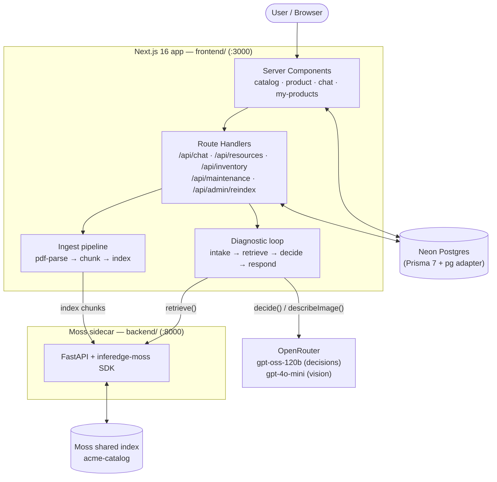

# Musk — AI Diagnostic Assistant for Product Support

> **Not a chatbot. Not a search engine. A technician for every product you own.**

Musk is a product-support platform whose differentiator is an AI **Diagnostic
Assistant** that runs an *iterative troubleshooting loop* — **not** plain RAG.
Instead of answering once from a vector search, Musk:

1. reads the customer's symptom (text **or a photo**),
2. retrieves candidate causes from the product's manual,
3. asks 2–4 **discriminating** follow-up questions to split the candidates apart,
4. re-ranks, then recommends a fix and **cites the source** (manual title + page).

It also tracks **ownership & maintenance schedules** per user, so the same manual
that powers diagnosis also drives "what does my scooter need next."

---

## Screenshots

| Catalog & Search | Product Detail |
|---|---|
|  |  |

| Diagnostic Chat | My Products Garage |
|---|---|
|  |  |

---

## Architecture



**Why a sidecar?** The Moss retrieval SDK (`inferedge-moss`) is Python-only, so a
thin FastAPI service hosts it and the Next.js app calls it over HTTP. All chunks
live in **one shared index** (`acme-catalog`), each tagged with `productId` in
metadata; queries filter to a single product (the free tier caps indexes at 3).

---

## Data model

```
Company (1) ──< Product (N) ──< Resource (N)
                                  ──< MaintenanceTask (N)
                                  ──< Conversation (N) ──< Message (N)

User (1) ──< UserInventory (N) ──< Product
                ──< UserMaintenanceStatus (N) ──< MaintenanceTask
```

| Model | Role |
|-------|------|
| `Company` | Top-level org owning products |
| `Product` | Name, slug, description, image |
| `Resource` | PDF/LINK attached to a product; holds `extractedText` for indexing |
| `MaintenanceTask` | Scheduled task template (name, interval in days) |
| `Conversation` | A diagnostic session tied to a product + user |
| `Message` | One turn; role USER or ASSISTANT, stores JSON `citations` |
| `UserInventory` | User-product link; tracks `purchasedAt` |
| `UserMaintenanceStatus` | Per-task per-user row; has `lastDoneAt`, `nextDueAt`, status enum |

Statuses are **computed** from `nextDueAt` (never stale). `DUE_SOON_DAYS = 14`.

---

## Tech stack

| Layer | Choice |
|-------|--------|
| App + API | Next.js 16.2 (App Router, Turbopack) |
| DB / ORM | Neon Postgres + Prisma 7 (`prisma-client` generator, `@prisma/adapter-pg`) |
| Retrieval | `inferedge-moss` via a FastAPI sidecar (`uv`) |
| LLM | OpenRouter — `gpt-oss-120b` (JSON decisions), `gpt-4o-mini` (vision) |
| PDF | `pdf-parse` v2 (per-page text) |
| Styling | Tailwind CSS v4 |
| Runtime | Node 20+, Python 3.12+ (uv) |

---

## Environment variables

### `frontend/.env`

| Var | Required | Notes |
|-----|----------|-------|
| `DATABASE_URL` | ✅ | Neon Postgres connection string (pooled endpoint recommended). Injected at CLI time via `prisma.config.ts` and at runtime via the pg adapter. |
| `OPENROUTER_API_KEY` | ✅ | Powers the decision step and the image vision step. |
| `OPENROUTER_MODEL` | — | Decision model. Default `openai/gpt-oss-120b`. |
| `OPENROUTER_VISION_MODEL` | — | Vision model. Default `openai/gpt-4o-mini`. |
| `MOSS_SERVICE_URL` | — | Sidecar URL. Default `http://localhost:8000`. |
| `MOSS_INDEX` | — | Shared index name. Default `acme-catalog`. |

### `backend/.env`

| Var | Required | Notes |
|-----|----------|-------|
| `MOSS_PROJECT_ID` | ✅ | Moss project id. |
| `MOSS_PROJECT_KEY` | ✅ | Moss project key. |
| `MOSS_INDEX` | — | Must match the frontend's `MOSS_INDEX` (default `acme-catalog`). |

---

## Setup

> Prerequisites: **Node 20+**, **npm**, and **[uv](https://docs.astral.sh/uv/)**
> for the Python sidecar. A reachable **Neon Postgres** database, an
> **OpenRouter** API key, and **Moss** project credentials.

### 1. Frontend (app + DB)

```bash
cd frontend
npm install

# create frontend/.env with DATABASE_URL and OPENROUTER_API KEY (see table above)

npx prisma migrate deploy   # apply migrations (URL comes from prisma.config.ts)
npx prisma generate         # generate client into app/generated/prisma
npx tsx prisma/seed.ts      # seed company, demo user, 3 products + PDF manuals

npm run dev                 # http://localhost:3000
```

### 2. Backend (Moss retrieval sidecar)

```bash
cd backend
uv sync

# create backend/.env with MOSS_PROJECT_ID and MOSS_PROJECT_KEY

uv run uvicorn main:app --port 8000
```

### 3. Bootstrap the retrieval index

The seed writes the manuals to disk but does not index them. With **both**
servers running, backfill the Moss index once:

```bash
curl -X POST http://localhost:3000/api/admin/reindex
```

### 4. Verify

```bash
curl http://localhost:3000/api/health     # -> { ok, db: "connected", counts }
curl http://localhost:8000/health         # -> { ok, moss_configured: true }
```

Open <http://localhost:3000>.

---

## Project layout

```
frontend/                 Next.js app + API routes (most of the product)
  app/
    page.tsx              landing (positioning + catalog)
    products/[id]/        product detail + /chat (Diagnostic Assistant)
    my-products/          ownership + maintenance log
    company/dashboard/    add product / upload resource
    api/                  route handlers
    lib/                  prisma, moss client, agent loop, maintenance, errors
    generated/prisma/     generated Prisma client (do not edit)
  prisma/                 schema.prisma, migrations, seed.ts, manuals.ts
  scripts/                isolated test scripts (diagnostic, maintenance, vision)
  public/
    manuals/              seeded PDF manuals (generated by seed.ts)
    uploads/              user-uploaded files
backend/                  FastAPI Moss retrieval sidecar (uv)
  main.py                 /index/{productId}, /query/{productId}, /health
images/                   screenshots for this README
```

---

## Feature checklist

- **Product catalog / marketplace**
  - [x] Browse catalog with client-side search (`/`)
  - [x] Product detail with resources + manual download (`/products/[id]`)
  - [x] Company dashboard to add products (`/company/dashboard`)
- **Resource ingestion (manuals → searchable knowledge)**
  - [x] PDF upload → extract per-page text → chunk with page metadata → index (`POST /api/resources`)
  - [x] External LINK resources
  - [x] One-shot backfill of seeded manuals (`POST /api/admin/reindex`)
- **AI Diagnostic Assistant (iterative loop, NOT plain RAG)**
  - [x] `intake → retrieve → decide → respond` loop (`app/lib/agent/diagnostic.ts`)
  - [x] Asks 2–4 discriminating questions, re-ranks candidate causes
  - [x] Recommends a fix with **citations** (manual title + page), resolves to RESOLVED
  - [x] Live candidate-cause rail + collapsible source chips (`/products/[id]/chat`)
- **Image-based troubleshooting**
  - [x] Attach a photo in chat (client-downscaled), vision pre-step describes it
  - [x] Description injected into the symptom history → influences questions/fix
- **Ownership & maintenance schedules**
  - [x] "Add to My Products" seeds per-task maintenance status (`POST /api/inventory`)
  - [x] `/my-products` overview + `/my-products/[id]/maintenance` service log
  - [x] Computed OVERDUE / DUE_SOON / OK badges; "Mark complete" rolls the schedule
  - [x] Live overdue-count badge in the nav

---

## Handy scripts (run from `frontend/`)

```bash
npx tsx scripts/test-diagnostic.ts     # isolated diagnostic loop (scooter)
npx tsx scripts/test-maintenance.ts    # maintenance status + mark-complete
npx tsx scripts/test-vision-chat.ts    # image troubleshooting end-to-end (needs both servers)
```

See [`DEMO.md`](./DEMO.md) for the 5-minute walkthrough.

---

## Development

### Running locally

Start both servers in separate terminals:

```bash
# Terminal 1 — frontend
cd frontend && npm run dev

# Terminal 2 — backend sidecar
cd backend && uv run uvicorn main:app --port 8000 --reload
```

### Running isolated tests

The scripts in `frontend/scripts/` exercise individual subsystems without
the browser. They connect to the live DB and (for `test-vision-chat`) the
sidecar.

```bash
cd frontend
npx tsx scripts/test-diagnostic.ts     # agent loop only
npx tsx scripts/test-maintenance.ts    # maintenance CRUD
npx tsx scripts/test-vision-chat.ts    # full chat with image upload
```

### Database changes

```bash
cd frontend
npx prisma migrate dev --name describe_change    # create + apply migration
npx prisma generate                              # regenerate client
npx tsx prisma/seed.ts                           # re-seed if needed
```

---

## Troubleshooting

| Symptom | Likely cause | Fix |
|---------|-------------|-----|
| `PrismaClientInitializationError` | DATABASE_URL missing or wrong | Check `frontend/.env`; verify Neon pooler endpoint. |
| Chunks not returned from Moss | Sidecar not running or wrong MOSS_INDEX | `curl localhost:8000/health`; check both `.env` files. |
| OpenRouter returns 401 | Missing or invalid API key | Set `OPENROUTER_API_KEY` in `frontend/.env`. |
| Seed fails — "relation does not exist" | Migrations not applied | Run `npx prisma migrate deploy` first. |
| `pdf-parse` throws on upload | Corrupted or scanned PDF | Try a text-based PDF; image-only PDFs not supported. |
| Vision step fails | MODEL not set to vision-capable model | Default `gpt-4o-mini` works; `gpt-oss-120b` is text-only. |

---

## License

Proprietary — built for the Moss AI Hackathon 2026.
