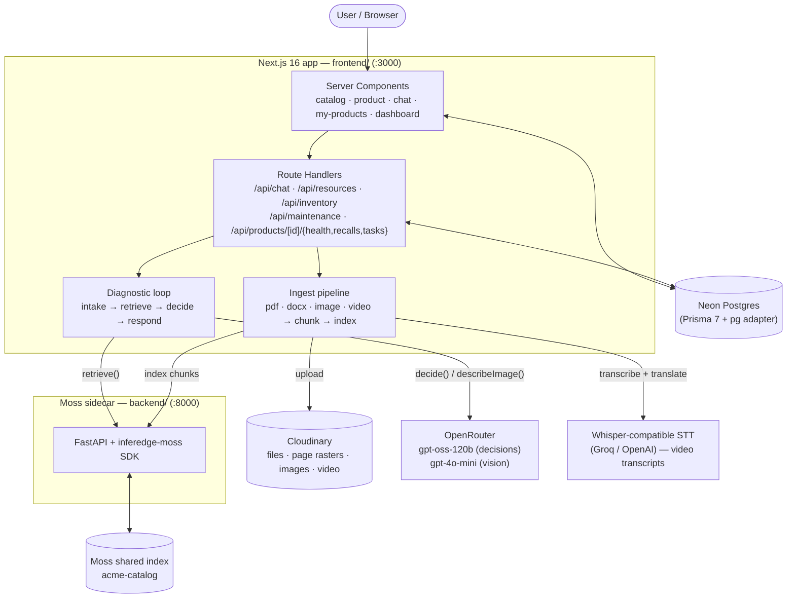

# Musk — AI Diagnostic Assistant for Product Support

> **Not a chatbot. Not a search engine. A technician for every product you own.**

Musk is a product-support platform whose differentiator is an AI **Diagnostic
Assistant** that runs an *iterative troubleshooting loop* — **not** plain RAG.
Instead of answering once from a vector search, Musk:

1. reads the customer's symptom (text, **a photo**, or **voice**),
2. retrieves candidate causes from the product's own manuals, images and videos,
3. asks 2–4 **discriminating** follow-up questions to split the candidates apart,
4. re-ranks, then recommends a fix, lists **spare parts**, and **cites the source**
   — manual page (`p.4`), a reference image, or a **deep-linked video segment**
   (`▶ 0:00–0:27`).

The same indexed manuals also power **ownership & maintenance schedules**,
**warranty & recall alerts**, and a company-side **product health score** — so one
knowledge base drives diagnosis *and* "what does my AC need next."

---

## Highlights

- **Iterative diagnostic loop, not one-shot RAG** — asks discriminating questions,
  live-re-ranks candidate causes, then recommends with citations.
- **Multi-format knowledge ingestion** — PDF (per-page) · DOCX · images (vision-described) ·
  **videos (transcribed + auto-translated to English)** · external links. Everything is
  uploaded to **Cloudinary** and indexed into a shared **Moss** vector index.
- **Cites real sources** — a manual page, a reference figure (thumbnail), or a video
  segment that **deep-links to the exact timestamp** (`url#t=startSec`).
- **Image-based troubleshooting** — snap a photo of an error panel; a vision pre-step
  describes it, folds it into the symptom, and can cross-match the company's own
  reference images.
- **Voice & hands-free** — browser-native speech-to-text dictation + text-to-speech
  read-back, with a hands-free mode for repairing with the phone nearby.
- **Spare-part suggestions** — surfaced *inside* the loop, only from cited manual excerpts.
- **Ownership, maintenance, warranty & recalls** — per-user inventory with computed
  due/overdue badges, warranty status, and recall notices.
- **Product health score** — mines diagnostic conversations for resolution rate and
  recurring root causes (a single dominant cause = systemic defect drags the score down).

---

## Screenshots

### Landing — the positioning


### Catalog & multi-format product knowledge
| Catalog | Product detail — PDF · DOCX · IMAGE resources |
|---|---|
|  |  |

A single product carries mixed resources — a PDF service manual, a DOCX, a reference
**image** (the "E1" error panel, vision-described) and a **video** walkthrough, each
indexed and citable:


### Diagnostic Assistant — the iterative loop in action
The user types *"i am facing e4 error"*; Musk recommends a fix at **98% confidence** and
cites the **video segment** `▶ 0:00–0:27` — note the excerpt is in **English** even though
the source video is Hindi (auto-translated at ingest):


### Owner's Garage — inventory, maintenance & health
| My Products | Maintenance log + health score |
|---|---|
|  |  |

### Company Dashboard — add products, upload any resource, manage upkeep
| Add product / upload resource | Maintenance tasks & warranty / recalls |
|---|---|
|  |  |


---

## Architecture



**Why a sidecar?** The Moss retrieval SDK (`inferedge-moss`) is Python-only, so a thin
FastAPI service hosts it and the Next.js app calls it over HTTP. All chunks live in **one
shared index** (`acme-catalog`), each tagged with `productId` in metadata; queries filter to
a single product (the Moss free tier caps indexes at 3, so one shared index supports
unlimited products).

**Why Cloudinary?** Nothing touches local disk — uploads survive a serverless deploy, and
the same PDF can be re-served as page-rasterized PNGs (`pg_N` transform) so figure/scan pages
are vision-described and indexed as images.

---

## The ingestion pipeline

`POST /api/resources` accepts any of these, uploads to Cloudinary, then indexes into Moss
(`app/lib/ingest.ts`). The resource row is kept even if indexing fails (sidecar down, missing
key) so nothing is lost.

| Kind | Pipeline | Citation locator |
|------|----------|------------------|
| **PDF** | `pdf-parse` per-page text → page chunks. Low-text pages (figures/scans) are rasterized via Cloudinary and **vision-described**, indexed as image chunks. | `p.4` / `figure p.4` |
| **DOCX** | `mammoth` → plain-text chunks | — |
| **IMAGE** | vision `describeImage` → the description is indexed (so a company diagram / error-code chart is searchable and citable **as the image**) | image thumbnail |
| **VIDEO** | Whisper-compatible transcription → split into ~30s **time-ranged** chunks. Defaults to the **`/audio/translations`** endpoint so non-English videos become English chunks. | `▶ M:SS–M:SS` deep-link |
| **LINK** | stored as a URL, nothing indexed | — |

Deleting a product or resource purges its chunks from Moss via the sidecar's
`POST /delete/{productId}` (best-effort), so nothing is orphaned.

---

## Data model

```
Company (1) ──< Product (N) ──< Resource (N)
                                  ──< MaintenanceTask (N)
                                  ──< Recall (N)
                                  ──< Conversation (N) ──< Message (N)

User (1) ──< UserInventory (N) ──< Product
                ──< UserMaintenanceStatus (N) ──< MaintenanceTask
```

| Model | Role |
|-------|------|
| `Company` | Top-level org owning products |
| `Product` | Name, slug, category, description, image, optional `warrantyMonths` |
| `Resource` | PDF / DOCX / IMAGE / VIDEO / LINK attached to a product; holds `url` (Cloudinary) + `extractedText` for indexing |
| `MaintenanceTask` | Scheduled task template (name, `intervalDays`, optional source note) |
| `Recall` | Notice / safety / recall (title, body, severity, optional url, `issuedAt`) |
| `Conversation` | A diagnostic session tied to a product + user |
| `Message` | One turn; role USER or ASSISTANT, stores JSON `citations` (sources, candidate causes, spare parts, photo) |
| `UserInventory` | User-product link; tracks `purchasedAt` |
| `UserMaintenanceStatus` | Per-task per-user row; has `lastDoneAt`, `nextDueAt`, status enum |

**Everything time-sensitive is computed, never stored stale:** maintenance status from
`nextDueAt` (`DUE_SOON_DAYS = 14`), warranty status from `purchasedAt + warrantyMonths`
(`WARRANTY_EXPIRING_DAYS = 30`), and the health score from stored conversation candidate causes.

---

## Tech stack

| Layer | Choice |
|-------|--------|
| App + API | Next.js 16.2 (App Router, Turbopack) |
| DB / ORM | Neon Postgres + Prisma 7 (`prisma-client` generator, `@prisma/adapter-pg`) |
| Retrieval | `inferedge-moss` via a FastAPI sidecar (`uv`) |
| LLM | OpenRouter — `gpt-oss-120b` (JSON decisions), `gpt-4o-mini` (vision) |
| File storage | Cloudinary (files, PDF page rasters, images, video) |
| Ingest | `pdf-parse` v2 (per-page) · `mammoth` (DOCX) · vision (images) · Whisper-compatible STT (video) |
| Voice | Web Speech API (browser-native STT + TTS) |
| Styling | Tailwind CSS v4 |
| Runtime | Node 20+, Python 3.12+ (uv) |

---

## Environment variables

### `frontend/.env`

| Var | Required | Notes |
|-----|----------|-------|
| `DATABASE_URL` | ✅ | Neon Postgres connection string (pooled endpoint recommended). Injected at CLI time via `prisma.config.ts` and at runtime via the pg adapter. |
| `OPENROUTER_API_KEY` | ✅ | Powers the decision step and the image vision step. |
| `OPENROUTER_MODEL` | — | Decision model. Default `openai/gpt-oss-120b`. |
| `OPENROUTER_VISION_MODEL` | — | Vision model. Default `openai/gpt-4o-mini` (gpt-oss-120b is text-only). |
| `CLOUDINARY_CLOUD_NAME` | ✅ | Cloudinary account — file/image/video uploads. |
| `CLOUDINARY_API_KEY` | ✅ | Cloudinary API key. |
| `CLOUDINARY_API_SECRET` | ✅ | Cloudinary API secret. |
| `CLOUDINARY_FOLDER` | — | Upload folder. Default `moss`. |
| `TRANSCRIBE_API_KEY` | — | Whisper-compatible key — needed only to ingest **videos**. |
| `TRANSCRIBE_BASE_URL` | — | Default OpenAI `https://api.openai.com/v1`; Groq = `https://api.groq.com/openai/v1`. |
| `TRANSCRIBE_MODEL` | — | Default `whisper-1`; Groq = `whisper-large-v3`. |
| `TRANSCRIBE_TRANSLATE` | — | Translate non-English videos to English (default `true`). Set `false` to keep the source language. |
| `MOSS_SERVICE_URL` | — | Sidecar URL. Default `http://localhost:8000`. |
| `MOSS_INDEX` | — | Shared index name. Default `acme-catalog`. |

### `backend/.env`

| Var | Required | Notes |
|-----|----------|-------|
| `MOSS_PROJECT_ID` | ✅ | Moss project id. |
| `MOSS_PROJECT_KEY` | ✅ | Moss project key. |
| `MOSS_INDEX` | — | Must match the frontend's `MOSS_INDEX` (default `acme-catalog`). |

---

## Setup

> Prerequisites: **Node 20+**, **npm**, and **[uv](https://docs.astral.sh/uv/)** for the
> Python sidecar. A reachable **Neon Postgres** database, an **OpenRouter** API key,
> **Cloudinary** credentials, and **Moss** project credentials. A Whisper-compatible key
> (e.g. **Groq**, free tier) is only needed to ingest videos.

### 1. Frontend (app + DB)

```bash
cd frontend
npm install

# create frontend/.env (see the table above)

npx prisma migrate deploy   # apply migrations (URL comes from prisma.config.ts)
npx prisma generate         # generate client into app/generated/prisma
npx tsx prisma/seed.ts      # idempotent, NON-destructive: ensures the AcmeMobility
                            # company + demo user exist (no demo products)

npm run dev                 # http://localhost:3000
```

### 2. Backend (Moss retrieval sidecar)

```bash
cd backend
uv sync

# create backend/.env with MOSS_PROJECT_ID and MOSS_PROJECT_KEY

uv run uvicorn main:app --port 8000
```

### 3. Add products & resources

There are **no seeded products** — add them from the **Company Dashboard**
(`/company/dashboard`): create a product, then upload its manuals/images/videos. Each upload
is sent to Cloudinary and indexed into Moss automatically.

To re-index existing PDF resources from their Cloudinary URLs (e.g. after a Moss reset), run:

```bash
curl -X POST http://localhost:3000/api/admin/reindex
```

### 4. Verify

```bash
curl http://localhost:3000/api/health     # -> { ok, db: "connected", counts }
curl http://localhost:8000/health         # -> { ok, moss_configured: true }
```

Open <http://localhost:3000>.

---

## Project layout

```
frontend/                 Next.js app + API routes (most of the product)
  app/
    page.tsx              landing (positioning + catalog)
    products/[id]/        product detail + /chat (Diagnostic Assistant, voice, photo)
    my-products/          ownership, maintenance log, warranty & recall alerts
    company/dashboard/    add product / upload resource / tasks / warranty / health
    api/                  route handlers
    lib/
      agent/              diagnostic loop, llm client, maintenance extractor
      ingest.ts chunk.ts  multi-format ingest → chunks
      moss.ts             sidecar client (index / query / delete)
      cloudinary.ts       uploads (file / image / video / page raster)
      transcribe.ts       Whisper-compatible transcription + translation
      maintenance.ts warranty.ts health.ts   computed status + analytics
    generated/prisma/     generated Prisma client (do not edit)
  prisma/                 schema.prisma, migrations, seed.ts
  scripts/                isolated test scripts (diagnostic, maintenance, vision)
backend/                  FastAPI Moss retrieval sidecar (uv)
  main.py                 /index, /query, /delete, /health
images/                   screenshots for this README
videos/                   sample support video(s)
```

---

## Feature checklist

- **Product catalog / marketplace**
  - [x] Browse catalog with client-side search (`/`)
  - [x] Product detail with resources, per-resource delete, manual download (`/products/[id]`)
  - [x] Company dashboard to add products + set warranty at create time (`/company/dashboard`)
- **Multi-format resource ingestion (manuals → searchable knowledge)**
  - [x] PDF → per-page text + vision-described figure pages → index (`POST /api/resources`)
  - [x] DOCX (`mammoth`) and external LINK resources
  - [x] Images → vision description, searchable & citable as the image
  - [x] **Videos → transcript split into time-ranged chunks, auto-translated to English**
  - [x] All files on **Cloudinary**; delete purges Moss chunks; reindex from URLs (`POST /api/admin/reindex`)
- **AI Diagnostic Assistant (iterative loop, NOT plain RAG)**
  - [x] `intake → retrieve → decide → respond` loop (`app/lib/agent/diagnostic.ts`)
  - [x] Asks 2–4 discriminating questions, live re-ranks candidate causes
  - [x] Recommends a fix with **citations** (page / image / video timestamp), resolves to RESOLVED
  - [x] **Spare-part suggestions** drawn only from cited manual excerpts
  - [x] Live candidate-cause rail + collapsible source chips (`/products/[id]/chat`)
- **Image-based troubleshooting**
  - [x] Attach a photo in chat (client-downscaled), vision pre-step describes it
  - [x] Description folded into the symptom history; can cross-match company reference images
- **Voice input/output (browser-native, zero backend)**
  - [x] Mic dictation (STT) + 🔊 reply read-back (TTS)
  - [x] Hands-free mode — reads each reply and re-opens the mic until a recommendation
- **Ownership & maintenance schedules**
  - [x] "Add to My Products" seeds per-task maintenance status (`POST /api/inventory`)
  - [x] `/my-products` overview + `/my-products/[id]/maintenance` service log
  - [x] Computed OVERDUE / DUE_SOON / OK badges; "Mark complete" rolls the schedule
  - [x] "Suggest from manual" proposes tasks from the product's extracted text
  - [x] Live overdue + alert count badge in the nav
- **Warranty & recall alerts**
  - [x] Per-product warranty length; computed ACTIVE / EXPIRING / EXPIRED status
  - [x] Publish recalls/notices (NOTICE / SAFETY / RECALL); owners see warranty + recalls
- **Company analytics**
  - [x] Product health score (resolution rate + recurring-cause concentration) on the dashboard

---

## Handy scripts (run from `frontend/`)

```bash
npx tsx scripts/test-diagnostic.ts     # isolated diagnostic loop (needs the sidecar)
npx tsx scripts/test-vision-chat.ts    # image troubleshooting end-to-end (needs both servers)
```

---

## Development

### Running locally

Start both servers in separate terminals:

```bash
# Terminal 1 — frontend
cd frontend && npm run dev

# Terminal 2 — backend sidecar
cd backend && uv run uvicorn main:app --port 8000 --reload
```

### Database changes

```bash
cd frontend
npx prisma migrate dev --name describe_change    # create + apply migration
npx prisma generate                              # regenerate client
npx tsx prisma/seed.ts                           # re-run the idempotent bootstrap
```

---

## Troubleshooting

| Symptom | Likely cause | Fix |
|---------|-------------|-----|
| `PrismaClientInitializationError` | DATABASE_URL missing or wrong | Check `frontend/.env`; verify Neon pooler endpoint. |
| Chunks not returned from Moss | Sidecar not running or wrong MOSS_INDEX | `curl localhost:8000/health`; check both `.env` files. |
| OpenRouter returns 401 | Missing or invalid API key | Set `OPENROUTER_API_KEY` in `frontend/.env`. |
| Upload fails | Cloudinary creds missing/wrong | Set `CLOUDINARY_*` in `frontend/.env`. |
| Video indexes but cites in another language | Translation disabled | Ensure `TRANSCRIBE_TRANSLATE` is not `false` (default translates to English). Re-upload the video to refresh chunks. |
| Video upload "indexing failed" | `TRANSCRIBE_API_KEY` missing | Set a Whisper-compatible key (Groq free tier works); the file is still kept. |
| Vision step fails | Model not vision-capable | Default `gpt-4o-mini` works; `gpt-oss-120b` is text-only. |

---

## License

Proprietary — built for the Moss AI Hackathon 2026.
